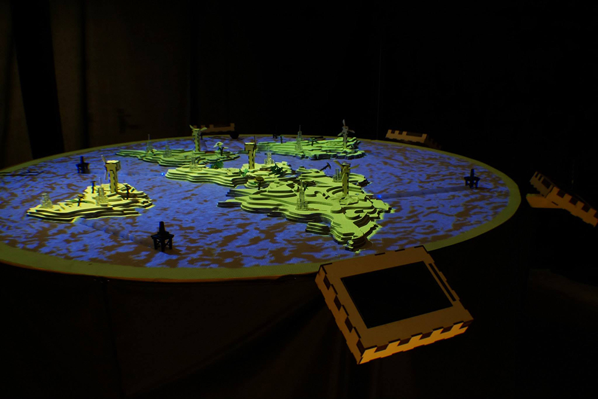
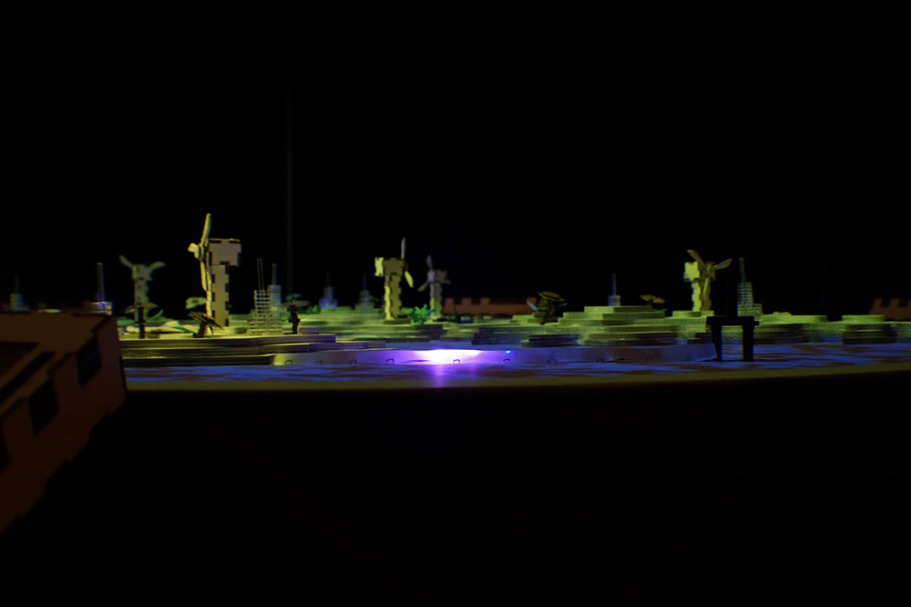
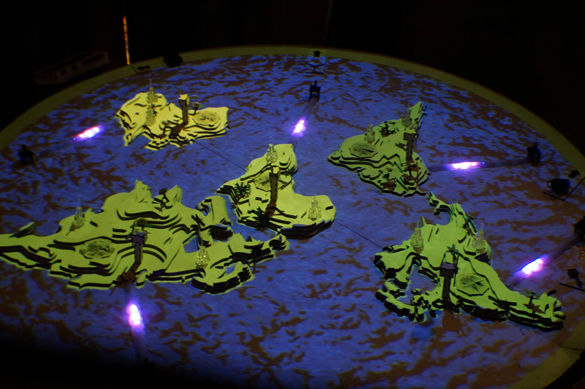
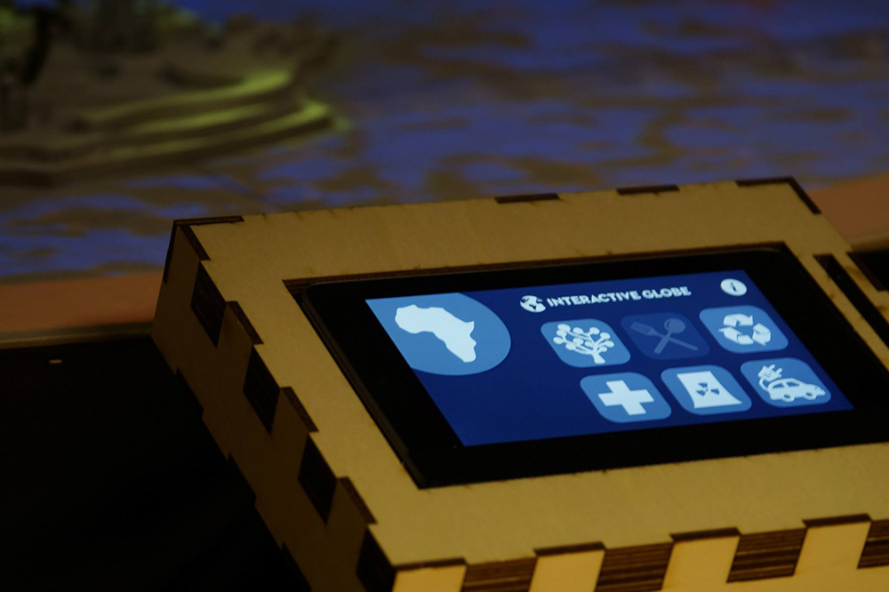
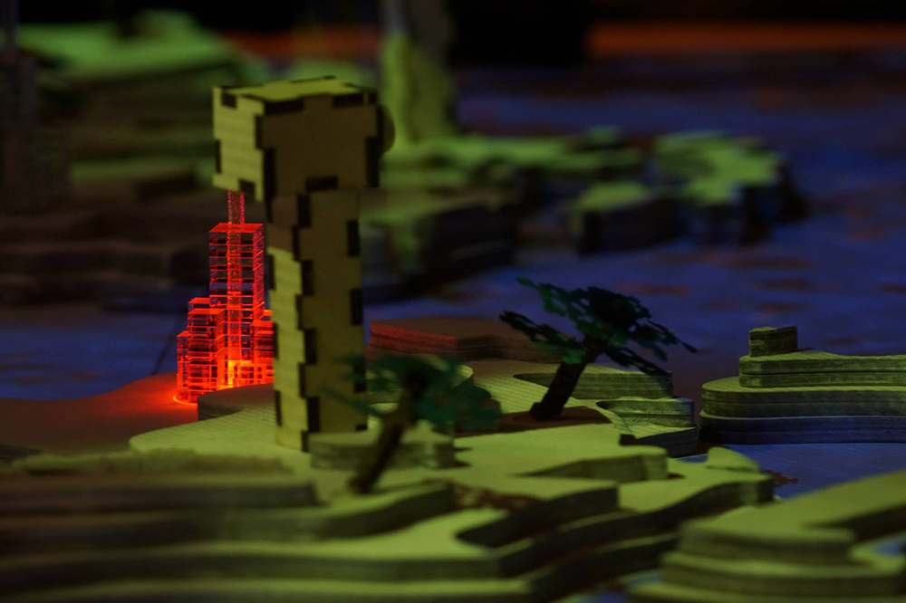
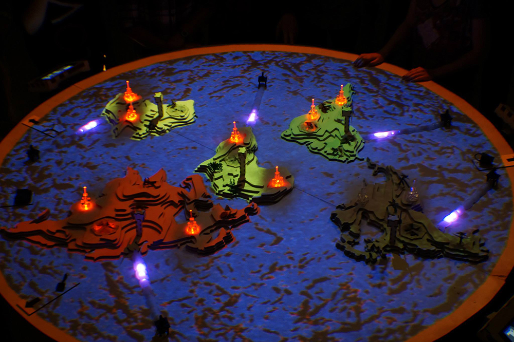

+++
title = "Interactive Globe"
description = "An interactive art and envronmental awareness installation."
date = "2016-12-24T22:54:26+01:00"
thumbnail = "/images/globe.jpg"
+++

An interactive art and envronmental awareness installation made for the Hybrid Worlds course.
This project was made by 20 Creative Technologists in the span of 2 weeks (that is without all the prior brainstorming).
I programmed the communication between all the seperate components with a nodejs server!



