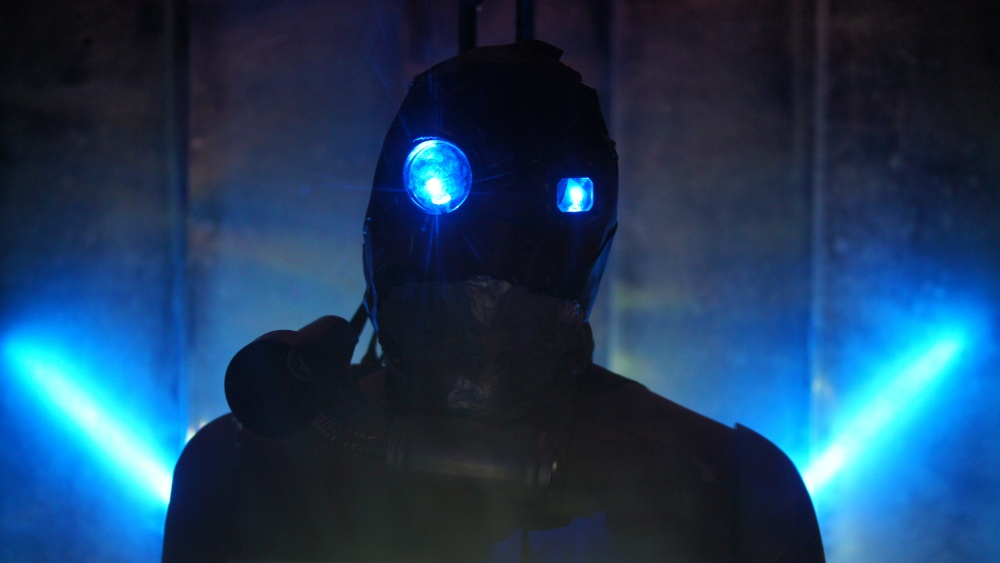
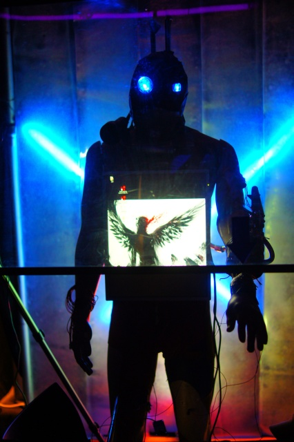

+++
title = "Gogbot"
description = "An interactive art installation about trans-humanism and cryogenics made for the gogbot festival."
date = "2016-12-24T22:54:56+01:00"
thumbnail = "/images/gogbot.jpg"
+++

An interactive art installation about trans-humanism and cryogenics made for the gogbot festival.
The Trans-human responds to when you touch it's hand and activates when you turn the valve.
Unmask the story and play a game to save his life!

Group members: [Adam Kemeny](http://adamk.net/), Remy Petrona, Boaz Vetter, Markus Hundt, Jeremy Henkes, Maaike Hillerstrom, Gerald Munters

